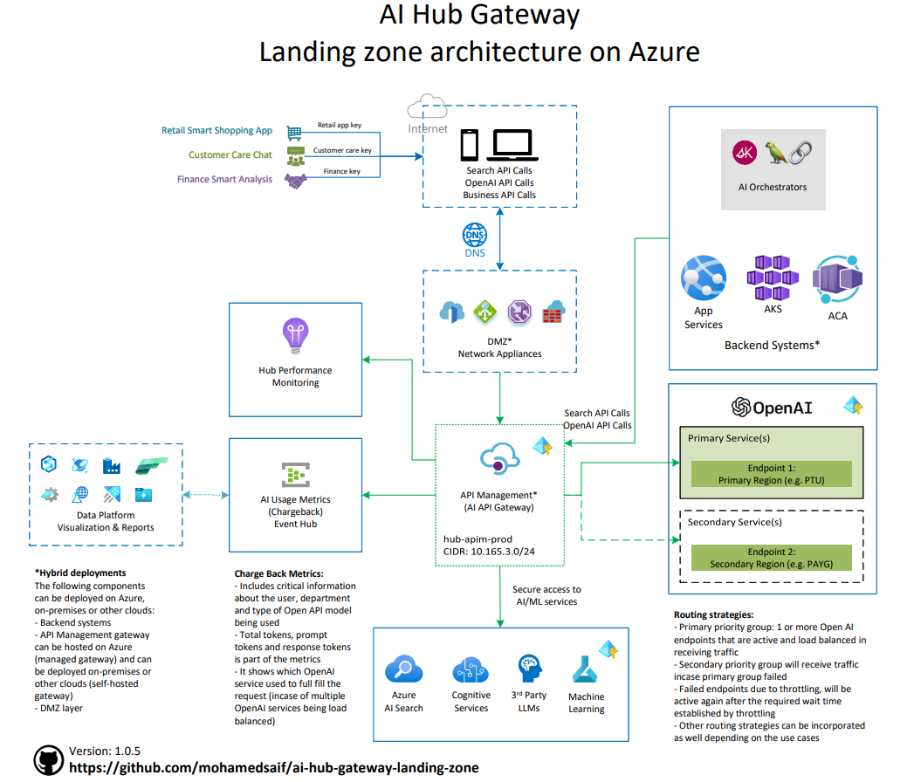

# AI Hub Gateway Landing Zone
The AI Hub Gateway Landing Zone is a reference architecture that provides a set of guidelines and best practices for implementing a central AI API gateway to empower various line-of-business units in an organization to leverage Azure AI services.

## Overview
The AI Hub Gateway Landing Zone is designed to be a central hub for AI services, providing a single point of entry for AI services, and enabling the organization to manage and govern AI services in a consistent manner. 



## Features
The AI Hub Gateway Landing Zone provides the following features:

- **Centralized AI API Gateway**: A central hub for AI services, providing a single point of entry for AI services that can be shared among multiple use-cases in a secure and governed approach.
- **Seamless integration with Azure AI services**: Ability to just update endpoints and keys in existing apps to switch to use AI Hub Gateway.
- **AI routing and orchestration**: The AI Hub Gateway Landing Zone provides a mechanism to route and orchestrate AI services, based on priority and target model enabling the organization to manage and govern AI services in a consistent manner.
- **No master keys**: The AI Hub Gateway Landing Zone does not use master keys to access AI services, instead, it uses managed identities to access AI services while consumers can use gateway keys.
- **Private connecitity**: The AI Hub Gateway Landing Zone is designed to be deployed in a private network, and it uses private endpoints to access AI services.
- **Capacity management**: The AI Hub Gateway Landing Zone provides a mechanism to manage capacity based on requests and tokens.
- **Usage & charge-back**: The AI Hub Gateway Landing Zone provides a mechanism to track usage and charge-back to the respective business units with flexible integration with existing charge-back & data platforms.
- **Resilient and scalable**: The AI Hub Gateway Landing Zone is designed to be resilient and scalable, and it uses Azure API Management with its zonal redudancy and regional gateways which provides a scalable and resilient solution.
- **Full observability**: The AI Hub Gateway Landing Zone provides full observability with Azure Monitor, Application Insights, and Log Analytics with detailed insights into performance, usage, and errors.
- **Hybrid support**: The AI Hub Gateway Landing Zone approach the deployment of backends and gateway on Azure, on-premises or other clouds.

## Architecture components
The AI Hub Gateway Landing Zone consists of the following components:

### Main gateway compoenets
These are the critical components of the AI Hub Gateway Landing Zone that provides the capaiblities outlined above.

- **Azure API Management**: Azure API Management is a fully managed service that enables customers to publish, secure, transform, maintain, and monitor APIs.
- **Application Insights**: Application Insights is an extensible Application Performance Management (APM) service that provides critical insights on the gateway operational performance.
- **Event Hub**: Event Hub is a fully managed, real-time data ingestion service that’s simple, trusted, and scalable and it is used to stream usage and charge-back data to target data and charge back platforms.

### AI services
This is the Azure AI services that will be exposed through the AI Hub Gateway Landing Zone.

Examples of these service could include:

- **Azure OpenAI**: Azure OpenAI is a cloud deployment of cutting edge generative models from OpenAI (like ChatGPT, DALL.E and more).
- **Azure AI Search**: Azure AI Search is a cloud search service with built-in AI capabilities that enrich all types of information to help users identify and explore relevant content at scale (critical compoenet of RAG-based generative AI applications).
- **Azure Cognitive Services**: Azure Cognitive Services is a set of cloud-based services with REST APIs and client library SDKs available to help you build cognitive intelligence into your applications.

### Backend services
These are the backend services that will include your AI business logic and experiences.

You can host backend services on Azure, on-premises, or other clouds.

Examples of these services could include:
- **Azure Kubernetes Service**: Azure Kubernetes Service (AKS) is a managed container orchestration service, based on the open-source Kubernetes system, which is available on the Microsoft Azure public cloud.
- **Azure Container Apps**: Azure Container Apps is a fully managed serverless container service that enables you to run containers on Azure without having to manage the infrastructure.
- **Azure App Service**: Azure App Service is a fully managed platform for building, deploying, and scaling web apps.

Also in these backends, it is common to use **AI Orchestrator** framework like [Semantic Kernel](https://github.com/microsoft/semantic-kernel) and [Langchain](https://www.langchain.com/) to orchestrate sophisticated AI workflows and scenarios.

### Data and charge-back platforms
As part of the AI Hub Gateway Landing Zone, you will need to integrate with existing data and charge-back platforms to track usage and charge-back to the respective business units.

Examples of these platforms could include:
- **Cosmos DB**: Azure Cosmos DB is a fully managed NoSQL database for storing usage and charge-back data.
- **Azure Synapse Analytics**: Azure Synapse Analytics is an analytics service that brings together enterprise data warehousing and big data analytics.
- **Microsoft Fabric**: Microsoft Fabric is a cloud-based platform that provides a scalable, reliable, and secure infrastructure for building and managing data and analytics solutions.
- **PowerBI**: Power BI is a business analytics service by Microsoft. It aims to provide interactive visualizations and business intelligence capabilities with an interface simple enough for end users to create their own reports and dashboards.

## Primary components deployment

Below is a high-level guide to deploy the AI Hub Gateway Landing Zone main components.

### Networking
For the AI Hub Gateway Landing Zone to be deployed, you will need to have/identify the following components:
- **Virtual network & subnet**: A virtual network to host the AI Hub Gateway Landing Zone.
    - APIM to be deployed in **internal mode** requires a subnet with /27 or larger with NSG that allows the critical rules.
    - **Private endpoints subnet(s)**: Private endpoints for the AI services to be exposed through the AI Hub Gateway Landing Zone. Usually a /27 or larger subnet would be sufficient.
- **Private DNS zone**: A private DNS zone to resolve the private endpoints.
    - Internal APIM reqlies on **private DNS** to resolve the APIM endpoints, so a Azure Private DNS zone or other DNS solution is required.
    - **Private endpoints DNS zone**: A private DNS zone to resolve the private endpoints for the connected Azure AI services.
- **ExpressRoute or VPN**: If you are planning to connect to on-premises or other clouds, you will need to have an ExpressRoute or VPN connection.
- **DMZ applicances**: If you are planning to expose backend and gateway services on the internet, you need to have a Web Application Firewall (like Azure Front Door & Application Gateway) and network filrewall (like Azure Firewall) to govern both ingress and egress traffic.

### Azure API Management (APIM)
APIM is the central component of the AI Hub Gateway Landing Zone. 

Recommended deployment of APIM to be in **internal mode** to ensure that the gateway is not exposed to the internet and to ensure that the gateway is only accessible through the private network.

**internal mode** requires a subnet with /27 or larger with NSG that allows the critical rules in addition to management public IP (with DNS label set)

This is a great starting point to deploy APIM in internal mode: [Deploy Azure API Management in internal mode](https://learn.microsoft.com/en-us/azure/api-management/api-management-using-with-internal-vnet?tabs=stv2)

### Application Insights
Application Insights is a critical component of the AI Hub Gateway Landing Zone, and it is used to monitor the operational performance of the gateway.

To deploy Application Insights, you can use the following guide: [How to integrate Azure API Management with Azure Application Insights](https://azure.github.io/apim-lab/apim-lab/6-analytics-monitoring/analytics-monitoring-6-2-application-insights.html) 

### Event Hub

Event Hub is used to stream usage and charge-back data to target data and charge back platforms.

To deploy Event Hub, you can use the following guide: [Logging with Event Hub](https://azure.github.io/apim-lab/apim-lab/6-analytics-monitoring/analytics-monitoring-6-3-event-hub.html)

### Additional components deployment

With the primary components deployed, you can now deploy or identify the AI services and backend services that will be exposed through the AI Hub Gateway.

Additional compoenets may include:
- **Azure OpenAI**: You can have 1 or more OpenAI services deployed (like one with PTU and one with PAYG)
- **Azure AI Search**: Azure AI Search with indexed data (1 or more indexes)
- **Backend services**: Backend services that will include your AI business logic and experiences (like a python chat app deployed on Azure App Service as an example).

For the above components, we need to ensure the following:
- **Private endpoints**: The AI services should be exposed through private endpoints.
- **Private DNS zone**: A private DNS zone to resolve the private endpoints for the connected Azure AI services.
- **APIM Managed identity**: Is granted access to Azure AI services (like OpenAI and AI Search).
- **Update endpoint and keys**: The backend services should use AI Hub Gateway endpoint and keys.
- **Usage & charge-back**: Identify the data pipeline for tokens usage and charge back based on Event Hub integration.

### Deployment summary

When deployment of primary components is completed, you will have the following components deployed:

- **Azure API Management**
- **Application Insights**
- **Event Hub**

Network wiring also will be established to allow the gateway to access the AI services through private endpoints, internet access through DMZ appliances and backend systems through private network.

with the additional compoenets deployed, you will have the following components identified:
- **Azure OpenAI** endpoints
- **Azure AI Search** endpoints
- **Backend services** updated endpoints and keys
- **Usage & charge-back** data pipeline (like pushing data to Comos DB and Synapse Analytics)

## Azure API Management configuration
To configure Azure API Management to expose the AI services through the AI Hub Gateway Landing Zone, you will need to configure the following:

- **APIs**: Import APIs definitions to APIM.
- **Products**: Create products to bundle one or more APIs under a common access terms/policies.
- **Policies**: Apply policies to the APIs to manage access, rate limits, and other governance policies.

### APIs
In this guide, I will be importing both OpenAI and AI Search APIs to APIM.

Many Azure services APIs are avaiable in [Azure REST API specs](https://github.com/Azure/azure-rest-api-specs/tree/main) reference on GitHub.

#### Azure OpenAI API
Although I have included the OpenAI API definition [in this repository](/src/apim/oai-api/oai-api-spec.yaml), you can also find the Azure OpenAI API definition in here: [Azure OpenAI API](https://github.com/Azure/azure-rest-api-specs/tree/main/specification/cognitiveservices/data-plane/AzureOpenAI/inference)

One included in the repository is inference version 2023-05-15 stable.

Only main change you need to do in the downloaded API definition is to update ```"url": "https://{endpoint}/openai",``` to ```"url": "https://TO-BE-RELACED/openai",``` to avoid confilict with APIM import validation.

#### Azure AI Search API
Same story with Azure AI Search, you can find a local copy [in this repository](/src/apim/ai-search-api/ai-search-api-spec.yaml).

I had to make few additional changes to the downloaded API definition to make it work with APIM import 
validation.

Public documentation for AI Search API can be found here: [Azure AI Search API](https://github.com/Azure/azure-rest-api-specs/tree/main/specification/search/data-plane/Azure.Search) (I used stable 2023-11-01 version).

## End-to-end scenario (Chat with data)

With the AI Hub Gateway Landing Zone deployed, you can now enable various line-of-business units in your organization to leverage Azure AI services in a secure and governed manner.

In this walkthrough, we will demonstrate an end-to-end scenario of a chat application that uses both Azure OpenAI and Azure AI Search through the AI Hub Gateway Landing Zone.

### Scenario overview

The chat application is designed to provide a conversational interface to users to interact with the AI services exposed through the AI Hub Gateway Landing Zone.

The following is the high level flow of the chat application:

- **Build your knowledge base**: 
    - Using Azure Storage, we will ingest documents and other information sources into a blob based storage
    - Using Azure AI Search, ingested data will be indexed using hybrid index (both keyword and semantic/embedding/vector based) to enable both keyword and semantic search
    - Azure AI Search index query endpoint will be exposed through the AI Hub Gateway Landing Zone
    - The index query endpoint will be used to search and retrieve relevant information from the knowledge base (using hybrid with semantic ranking)
- **Build your chat experience**:
    - Get user input: user prompt + chat history (UX)
    - Check and answer in cache, if new question, proceed with retrieval 
    - Build search query: through LLM, pass in user input with a prompt to generate improved search query 
    - Submit search query to Azure AI Search: to retrieve top N list of relevant documents (best results hybrid + semantic ranking)
    - Getting the answer: submit input, relevant documents and system prompt to LLM for answer

As you can see from the chat experience, the chat application uses both Azure AI Search and Azure OpenAI through the AI Hub Gateway Landing.

Also, the chat application is required to archestrate multiple AI services calls to provide the functionality, and for that it uses an AI Orchestrator framework like **Semantic Kernel** or **Langchain**.

### Source code

In this guide, I'm using the following `C#` based chat application that can be found here: [https://github.com/Azure-Samples/azure-search-openai-demo-csharp](https://github.com/Azure-Samples/azure-search-openai-demo-csharp)

> **Note**: The source code is a simple chat application that uses Azure AI Search and Azure OpenAI and can be found in mulitple languages/frameworks. You can use any language/framework of your choice to build the chat application that can be found here [https://github.com/Azure-Samples/azure-search-openai-demo](https://github.com/Azure-Samples/azure-search-openai-demo)

The above source code is designed to connect directly to Azure AI services through managed identitiy of Azure Container Apps. 

Minor modifications to chat app code are required to connect to the AI Hub Gateway Landing Zone.

1. **Update the endpoint**: Update the endpoint of the AI services to the AI Hub Gateway endpoint.
2. **Update the key**: Update the key of the AI services to the AI Hub Gateway key.
    - This will require code changes to shift from using managed identity to gateway key.
    - This also will require updating the deployed Azure Key Vault secrets to include the gateway key.
    - This includes changes to both Azure OpenAI and Azure AI Search endpoints and keys.
