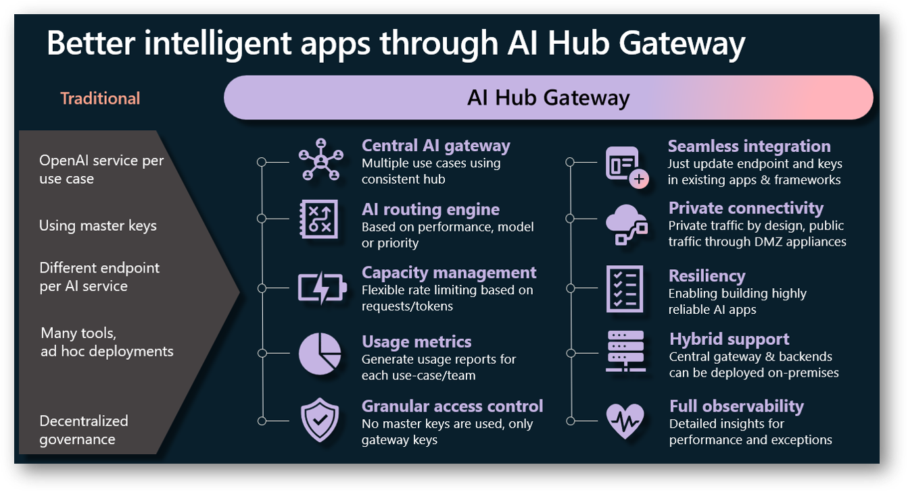

# AI Hub Gateway Landing Zone
The AI Hub Gateway Landing Zone is a reference architecture that provides a set of guidelines and best practices for implementing a central AI API gateway to empower various line-of-business units in an organization to leverage Azure AI services.

## V2 of the AI Hub Gateway Landing Zone solution accelerator is now available!  🚀

I'm working on V2 of the AI Hub Gateway Landing Zone solution accelerator is now available on [azd-deployment](https://github.com/mohamedsaif/ai-hub-gateway-landing-zone/tree/azd-deployment) branch! 

The V2 version of the solution accelerator provides a more comprehensive and robust solution for implementing a central AI API gateway to empower various line-of-business units in an organization to leverage Azure AI services. 

>NOTE: The V2 version is still work in progress and I'm working on adding more features and capabilities to the solution accelerator.

## Overview
The AI Hub Gateway Landing Zone is designed to be a central hub for AI services, providing a single point of entry for AI services, and enabling the organization to manage and govern AI services in a consistent manner. 


## Azure architecture diagram
This example diagram shows how these different Azure services would interact in a classic [hub-spoke topology](https://learn.microsoft.com/en-us/azure/architecture/networking/architecture/hub-spoke?tabs=cli). 


### Networking

The AI Landing Zone Virtual Network could be connected to the spokes via [virtual network peering](https://learn.microsoft.com/en-us/azure/virtual-network/virtual-network-peering-overview). The different applications (applications A, B and C) laying in the spoke networks would be able to resolve the API Management endpoint for their AI service consumption.

The different Azure OpenAi services would not be accessible to other external services, only being accessible through the API Management instance, being able to communicate to those instances via [Private Links](https://learn.microsoft.com/en-us/azure/private-link/private-link-overview).

For more details, see the [networking components section](#networking-components).

### AI Services and Indexes
The API Management instance would be able to communicate with one-to-many Azure OpenAI or AI service, as illustrated in the diagram. This can be a mix of 1 or more services, in 1 or more subscriptions, and also be of different model types, such as [Azure OpenAI Services](https://learn.microsoft.com/en-us/azure/ai-services/openai/overview) or other models in [Azure Machine Learning Studio, for example Mistral](https://learn.microsoft.com/en-us/azure/machine-learning/how-to-deploy-models-mistral?view=azureml-api-2).

It is also possible to make [Azure AI Search](https://learn.microsoft.com/en-us/azure/search/search-what-is-azure-search) indexes available through the API Management instance. This is particularly useful when wanting to consume a same index of data in several applications, while ensuring finer-grain control on the index.

For more details, see the [additional components section](#additional-components-deployment).

### Other data sources
Other data sources, such as Cosmos DB or SQL databases, could also be used as data sources to create the AI Search index.

### Cross-charging and token consumption count
When sharing AI consumption with different applications, sometimes it would be beneficial to know the token consumption for each application, in order to calculate charge-backs. This is possible using a combination of different services, such as Event Hub, Synapse Analytics, Cosmos DB and PowerBI.
For more details, see the [data and charge-back platforms section](#data-and-charge-back-platforms).

## Features



The AI Hub Gateway Landing Zone provides the following features:

- **Centralized AI API Gateway**: A central hub for AI services, providing a single point of entry for AI services that can be shared among multiple use-cases in a secure and governed approach.
- **Seamless integration with Azure AI services**: Ability to just update endpoints and keys in existing apps to switch to use AI Hub Gateway.
- **AI routing and orchestration**: The AI Hub Gateway Landing Zone provides a mechanism to route and orchestrate AI services, based on priority and target model enabling the organization to manage and govern AI services in a consistent manner.
- **No master keys**: The AI Hub Gateway Landing Zone does not use master keys to access AI services, instead, it uses managed identities to access AI services while consumers can use gateway keys.
- **Private connectivity**: The AI Hub Gateway Landing Zone is designed to be deployed in a private network, and it uses private endpoints to access AI services.
- **Capacity management**: The AI Hub Gateway Landing Zone provides a mechanism to manage capacity based on requests and tokens.
- **Usage & charge-back**: The AI Hub Gateway Landing Zone provides a mechanism to track usage and charge-back to the respective business units with flexible integration with existing charge-back & data platforms.
- **Resilient and scalable**: The AI Hub Gateway Landing Zone is designed to be resilient and scalable, and it uses Azure API Management with its zonal redundancy and regional gateways which provides a scalable and resilient solution.
- **Full observability**: The AI Hub Gateway Landing Zone provides full observability with Azure Monitor, Application Insights, and Log Analytics with detailed insights into performance, usage, and errors.
- **Hybrid support**: The AI Hub Gateway Landing Zone approach the deployment of backends and gateway on Azure, on-premises or other clouds.

## Architecture components
The AI Hub Gateway Landing Zone consists of the following components:

### Main gateway components
These are the critical components of the AI Hub Gateway Landing Zone that provides the capabilities outlined above.

- **Azure API Management**: Azure API Management is a fully managed service that enables customers to publish, secure, transform, maintain, and monitor APIs.
- **Application Insights**: Application Insights is an extensible Application Performance Management (APM) service that provides critical insights on the gateway operational performance.
- **Event Hub**: Event Hub is a fully managed, real-time data ingestion service that’s simple, trusted, and scalable and it is used to stream usage and charge-back data to target data and charge back platforms.

### AI services
This is the Azure AI services that will be exposed through the AI Hub Gateway Landing Zone.

Examples of these service could include:

- **Azure OpenAI**: Azure OpenAI is a cloud deployment of cutting edge generative models from OpenAI (like ChatGPT, DALL.E and more).
- **Azure AI Search**: Azure AI Search is a cloud search service with built-in AI capabilities that enrich all types of information to help users identify and explore relevant content at scale (critical component of RAG-based generative AI applications).
- **Azure Cognitive Services**: Azure Cognitive Services is a set of cloud-based services with REST APIs and client library SDKs available to help you build cognitive intelligence into your applications.

### Backend services
These are the backend services that will include your AI business logic and experiences.

You can host backend services on Azure, on-premises, or other clouds.

Examples of these services could include:
- **Azure Kubernetes Service**: Azure Kubernetes Service (AKS) is a managed container orchestration service, based on the open-source Kubernetes system, which is available on the Microsoft Azure public cloud.
- **Azure Container Apps**: Azure Container Apps is a fully managed serverless container service that enables you to run containers on Azure without having to manage the infrastructure.
- **Azure App Service**: Azure App Service is a fully managed platform for building, deploying, and scaling web apps.

Also in these backends, it is common to use **AI Orchestrator** framework like [Semantic Kernel](https://github.com/microsoft/semantic-kernel) and [Langchain](https://www.langchain.com/) to orchestrate sophisticated AI workflows and scenarios.

### <a name="data-and-charge-back-platforms">Data and charge-back platforms</a>

As part of the AI Hub Gateway Landing Zone, you will need to integrate with existing data and charge-back platforms to track usage and charge-back to the respective business units.

Examples of these platforms could include:
- **Cosmos DB**: Azure Cosmos DB is a fully managed NoSQL database for storing usage and charge-back data.
- **Azure Synapse Analytics**: Azure Synapse Analytics is an analytics service that brings together enterprise data warehousing and big data analytics.
- **Microsoft Fabric**: Microsoft Fabric is a cloud-based platform that provides a scalable, reliable, and secure infrastructure for building and managing data and analytics solutions.
- **PowerBI**: Power BI is a business analytics service by Microsoft. It aims to provide interactive visualizations and business intelligence capabilities with an interface simple enough for end users to create their own reports and dashboards.

## Primary components deployment

Below is a high-level guide to deploy the AI Hub Gateway Landing Zone main components.

### <a name="networking-components">
Networking components
</a>
For the AI Hub Gateway Landing Zone to be deployed, you will need to have/identify the following components:
- **Virtual network & subnet**: A virtual network to host the AI Hub Gateway Landing Zone.
    - APIM to be deployed in **internal mode** requires a subnet with /27 or larger with NSG that allows the critical rules.
    - **Private endpoints subnet(s)**: Private endpoints for the AI services to be exposed through the AI Hub Gateway Landing Zone. Usually a /27 or larger subnet would be sufficient.
- **Private DNS zone**: A private DNS zone to resolve the private endpoints.
    - Internal APIM relies on **private DNS** to resolve the APIM endpoints, so a Azure Private DNS zone or other DNS solution is required.
    - **Private endpoints DNS zone**: A private DNS zone to resolve the private endpoints for the connected Azure AI services.
- **ExpressRoute or VPN**: If you are planning to connect to on-premises or other clouds, you will need to have an ExpressRoute or VPN connection.
- **DMZ appliances**: If you are planning to expose backend and gateway services on the internet, you need to have a Web Application Firewall (like Azure Front Door & Application Gateway) and network firewall (like Azure Firewall) to govern both ingress and egress traffic.

### Azure API Management (APIM)
APIM is the central component of the AI Hub Gateway Landing Zone. 

Recommended deployment of APIM to be in **internal mode** to ensure that the gateway is not exposed to the internet and to ensure that the gateway is only accessible through the private network.

**internal mode** requires a subnet with /27 or larger with NSG that allows the critical rules in addition to management public IP (with DNS label set)

This is a great starting point to deploy APIM in internal mode: [Deploy Azure API Management in internal mode](https://learn.microsoft.com/en-us/azure/api-management/api-management-using-with-internal-vnet?tabs=stv2)

### Application Insights
Application Insights is a critical component of the AI Hub Gateway Landing Zone, and it is used to monitor the operational performance of the gateway.

To deploy Application Insights, you can use the following guide: [How to integrate Azure API Management with Azure Application Insights](https://azure.github.io/apim-lab/apim-lab/6-analytics-monitoring/analytics-monitoring-6-2-application-insights.html) 

### Event Hub

Event Hub is used to stream usage and charge-back data to target data and charge back platforms.

To deploy Event Hub, you can use the following guide: [Logging with Event Hub](https://azure.github.io/apim-lab/apim-lab/6-analytics-monitoring/analytics-monitoring-6-3-event-hub.html)

### <a name="additional-components-deployment">Additional components deployment</a>

With the primary components deployed, you can now deploy or identify the AI services and backend services that will be exposed through the AI Hub Gateway.

Additional components may include:
- **Azure OpenAI**: You can have 1 or more OpenAI services deployed (like one with PTU and one with PAYG)
- **Azure AI Search**: Azure AI Search with indexed data (1 or more indexes)
- **Backend services**: Backend services that will include your AI business logic and experiences (like a python chat app deployed on Azure App Service as an example).

For the above components, we need to ensure the following:
- **Private endpoints**: The AI services should be exposed through private endpoints.
- **Private DNS zone**: A private DNS zone to resolve the private endpoints for the connected Azure AI services.
- **APIM Managed identity**: Is granted access to Azure AI services (like OpenAI and AI Search).
- **Update endpoint and keys**: The backend services should use AI Hub Gateway endpoint and keys.
- **Usage & charge-back**: Identify the data pipeline for tokens usage and charge back based on Event Hub integration.

### Deployment summary

When deployment of primary components is completed, you will have the following components deployed:

- **Azure API Management**
- **Application Insights**
- **Event Hub**

Network wiring also will be established to allow the gateway to access the AI services through private endpoints, internet access through DMZ appliances and backend systems through private network.

with the additional components deployed, you will have the following components identified:
- **Azure OpenAI** endpoints
- **Azure AI Search** endpoints
- **Backend services** updated endpoints and keys
- **Usage & charge-back** data pipeline (like pushing data to Cosmos DB and Synapse Analytics)

## Azure API Management configuration
To configure Azure API Management to expose the AI services through the AI Hub Gateway Landing Zone, you will need to configure the following:

- **APIs**: Import APIs definitions to APIM.
- **Products**: Create products to bundle one or more APIs under a common access terms/policies.
- **Policies**: Apply policies to the APIs to manage access, rate limits, and other governance policies.

### APIs import
In this guide, I will be importing both OpenAI and AI Search APIs to APIM.

Many Azure services APIs are available in [Azure REST API specs](https://github.com/Azure/azure-rest-api-specs/tree/main) reference on GitHub.

#### Azure OpenAI API
Although I have included the OpenAI API definition [in this repository](/src/apim/oai-api/oai-api-spec-2024-02-01.yaml), you can also find the Azure OpenAI API definition in here: [Azure OpenAI API](https://github.com/Azure/azure-rest-api-specs/tree/main/specification/cognitiveservices/data-plane/AzureOpenAI/inference)

One included in the repository is inference version 2024-02-01 stable.

Only main change you need to do in the downloaded API definition is to update ```"url": "https://{endpoint}/openai",``` to ```"url": "https://TO-BE-RELACED/openai",``` to avoid conflict with APIM import validation.

> **Important**: You need to append ```/openai``` to your selected ```API URL suffix``` in APIM import dialog to be something like (ai-hub-gw/openai). This is important as OpenAI SDK append /openai to the endpoint URL (not doing so you might get 404 errors from the client connecting to AI Hub Gateway endpoint).

One last thing, you need to update APIM subscription header name from ```Ocp-Apim-Subscription-Key``` to ```api-key``` to match the OpenAI SDK default implementation (not doing so you might get 401 unauthorized error).

#### Azure AI Search API
Same story with Azure AI Search, you can find a local copy [in this repository](/src/apim/ai-search-api/ai-search-api-spec.yaml).

I had to make few additional changes to the downloaded API definition to make it work with APIM import 
validation.

Public documentation for AI Search API can be found here: [Azure AI Search API](https://github.com/Azure/azure-rest-api-specs/tree/main/specification/search/data-plane/Azure.Search) (I used stable 2023-11-01 version).

### Gateway routing strategies (APIM)

When it comes to GenAI APIs, a need for advanced routing strategies arises to manage the capacity and resiliency for smooth AI-infused experiences across multiple clients.

Setting these policies in APIM will allow for advanced routing based on the region and model in addition to the priority and throttling status.

Dimensions of the routing strategies include:
- **Global vs. regional**: Ability to route to traffic to different regional gateway might be a requirement to ensure low latency, high availability and data residency.
    - For example, if you have a global deployment of AI Hub Gateway, you might want to route traffic to the nearest gateway to the client, or route that traffic to a specific gateway based on regulatory requirements.
- **Model-based routing**: Ability to route to traffic based on requested model is critical as not all OpenAI regional deployments support all capabilities and versions.
    - For example, if you can have gpt-4-vision model that is only available in 2 regions, you might want to load balance traffic to these 2 regions only.
- **Priority based routing**: Ability to route traffic based on priority is critical to ensure that the traffic is routed to preferred region first and fall back to other deployments when primary deployment is not available.
    - For example, if you have a Provisioned Throughput Unit (PTU) deployment in certain region, you might want to route all traffic to that deployment to maximize its utilization and only fall back to a secondary deployment in another region when the PTU is throttling (this also should revert back to primary when it is available again).
- **Throttling fallback support**: Ability to take a specific route out of the routing pool if it is throttling and fall back to the next available route.
    - For example, if you have a OpenAI deployment that is throttling, AI Hub Gateway should be able to take it out of the routing pool and fall back to the next available deployment and register the time needed before it is available again you might want so it can be brought back into the pool.
- **Configuration update**: Ability to update the routing configuration without affecting the existing traffic is critical to allow for rolling updates of the routing configuration.
    - For example, if you have a new OpenAI deployment that is available, you might want to update the routing configuration to include it and allow for new traffic to be routed to it without affecting the existing traffic (and in also support rolling back certain update when needed).

In the [src/apim/policies](/src/apim/oa-fragments) folder, you will find the policy fragments that you can use to apply to the OpenAI API.

I've built my routing strategy based the great work of [APIM Smart Load Balancing](https://github.com/andredewes/apim-aoai-smart-loadbalancing/tree/main), it is worth checking out.

I've built on top of that additional capabilities to make the solution address all the needs outlined above for a robust and reliable AI routing engine.

Implementation details are as follows:
- **Clusters (model based routing)**: it is a simple concept to group multiple OpenAI endpoints that support specific OpenAI deployment name. 
    - This to support model-based routing
    - For example, if the model is gpt-4 and it exists only in 2 regions, I will create a cluster with these 2 endpoints only. On the other hand, gpt-35-turbo exists in 5 regions, I will create a cluster with these 5 endpoints.
    - In order for this routing to work, OpenAI deployment names across regions must use the same name as I rely on the URL path to extract the direct deployment name which then results in specific routes to be used.
- **Routes**: It is json array that include all OpenAI endpoints with metadata.
    - Each cluster will reference supported route from this json array
    - Each route will have a friendly name, location, priority, and throttling status.
- **Clusters and routes caching**: using APIM cache to store clusters and routes to allow it to be shared across multiple API calls contexts.
    - **Configurations update**: Using API revision part of the caching key to allow for rolling updates of the clusters and routes through:
        - Creating new API revision with updated clusters and routes
        - Updating the API revision to be current (which will result in immediate creation of new cache entry with the updated clusters and routes)
        - API revision number is part of the cache key for both clusters and routes.
        - If configuration roll back is critical, you might want to add the routing policies directly in OpenAI API - All Operations policy scope (as policy fragments don't support revisions).
    - **Multi-region support**: Each clusters array will be stored with region name as part of the cache key to allow for multi-region support.

Based on this implementation, APIM should be able to do advanced routing based on the region and model in addition to the priority and throttling status.

Having revision number as part of the cache key will allow for rolling updates of the clusters and routes.

Also at any given time, you will have different cached routes that represent different models/region, and based on the incoming request, you can route to the correct OpenAI endpoint.

Let's have a look at the policy fragments components:

#### oai-clusters-lb-configuration-in-policy.xml
This inbound policy fragment contains the main clusters and routes configurations.

Let's have a look at the configuration components:

- **Routes**: a json array that include the routes to various Azure OpenAI endpoints.
```csharp
JArray routes = new JArray();
routes.Add(new JObject()
        {
            { "name", "REPLACE1" },
            { "location", "swedencentral" },
            { "url", "https://REPLACE1.openai.azure.com" },
            { "priority", 1},
            { "isThrottling", false }, 
            { "retryAfter", DateTime.MinValue } 
        });

routes.Add(new JObject()
        {
            { "name", "REPLACE2" },
            { "location", "westeurope" },
            { "url", "https://REPLACE2.openai.azure.com" },
            { "priority", 1},
            { "isThrottling", false },
            { "retryAfter", DateTime.MinValue }
        });
```
- **Clusters**: a json array that include the clusters to various Azure OpenAI endpoints.
```csharp
JArray clusters = new JArray();
clusters.Add(new JObject()
        {
            { "deploymentName", "gpt-35-turbo" },
            { "routes", new JArray(routes[0], routes[1]) }
        });

clusters.Add(new JObject()
        {
            { "deploymentName", "embedding" },
            { "routes", new JArray(routes[0], routes[1]) }
        });

clusters.Add(new JObject()
        {
            { "deploymentName", "gpt-4" },
            { "routes", new JArray(routes[0]) }
        });

clusters.Add(new JObject()
        {
            { "deploymentName", "dall-e-3" },
            { "routes", new JArray(routes[0]) }
        });
```
- **Caching**: caching the clusters and routes to allow it to be shared across multiple API calls contexts.
```xml
<cache-store-value key="@("oaClusters" + context.Deployment.Region + context.Api.Revision)" value="@((JArray)context.Variables["oaClusters"])" duration="60" />

<cache-store-value key="@(context.Request.MatchedParameters["deployment-id"] + "Routes" + context.Deployment.Region + context.Api.Revision)" value="@((JArray)context.Variables["routes"])" duration="60" />
```

#### oai-clusters-lb-configuration-be-policy.xml
This backend policy fragment contains the main routing logic for the configured inbound policy above.

It selects the available routes based on model, region and API revision and provide the smart load balancing capabilities:
- Priority based routing:
    - Like if you have a cluster with 3 routs, 2 with priority 1 and 1 with priority 2, the gateway will always randomly select one of the 2 routes with priority 1 first and fall back to priority 2 if the first 2 routes are not available (is throttling).
- Throttling support:
    - Ability to take a specific route out of the routing pool if it is throttling and fall back to the next available route.
    - Activate the throttling route after a specific time (retryAfter) to allow for the route to be available again.

For more elaborate description of this routing, refer to the original [APIM Smart Load Balancing](https://github.com/andredewes/apim-aoai-smart-loadbalancing/tree/main) implementation.

#### oai-usage-eventhub-out-policy.xml
This outbound policy fragment contains the main usage tracking logic for the configured inbound policy above.

It sends the usage data to the configured Event Hub to allow for usage tracking and charge-back.

To use this policy, you need first to configure the Event Hub logger connection string and name.
```ps1
# API Management service-specific details
$apimServiceName = "apim-ai-gateway"
$resourceGroupName = "rg-ai-gateway"

# Event Hub connection string
$eventHubConnectionString = "Endpoint=sb://<EventHubsNamespace>.servicebus.windows.net/;SharedAccessKeyName=<KeyName>;SharedAccessKey=<key

# Create logger
$context = New-AzApiManagementContext -ResourceGroupName $resourceGroupName -ServiceName $apimServiceName
New-AzApiManagementLogger -Context $context -LoggerId "chargeback-eventhub-logger" -Name "chargeback-eventhub-logger" -ConnectionString $eventHubConnectionString -Description "Event Hub logger for OpenAI usage metrics"
```

Using this policy, you will have records like the following (I used CosmosDb to store these metrics from Event Hub through Stream Analytics job):

```json
{
    "id": "chatcmpl-91p2WwO4gvev3KSpwDwWjvdMsEpDs",
    "timestamp": "2024-03-12T05:32:32.0000000Z",
    "appId": "0000000-0000-4f5f-8ccf-8287272b09ad",
    "subscriptionId": "master",
    "productName": "AI-Marketing",
    "targetService": "chat.completion",
    "model": "gpt-35-turbo",
    "routeUrl": "https://REPLACE1.openai.azure.com/openai",
    "routeLocation": "swedencentral",
    "routeName": "SwedenCentralAzureOpenAI",
    "promptTokens": 9,
    "responseTokens": 10,
    "totalTokens": 19,
    "EventProcessedUtcTime": "2024-03-12T05:33:45.5528316Z",
    "PartitionId": 0,
    "EventEnqueuedUtcTime": "2024-03-12T05:32:32.8800000Z",
    "deploymentName": "gpt-35-turbo"
}
```

Based on these records, I've created the following PowerBI dashboard to track the usage and charge-back:


#### oai-blocked-streaming-in-policy.xml
This inbound policy fragment that prevent streaming requests to the OpenAI API.

Currently streaming has 2 challenges when it comes to charge back and usage tracking:
- Current approach to usage metrics logging do not support streaming requests due to conflict with response buffering (which result in 500 error), so you can't use ```log-to-eventhub``` policy.
- OpenAI streaming requests do not provide usage metrics in the response as it stands today (maybe it will change in the future).

APIM is perfectly fine to proxy streamed backends, but usage metrics will not be captured.

One solution to this is to use an app as backend to log the usage metrics and charge-back and proxy the streaming requests.

This app will rely on a token counting SDK to manually calculate the tokens and ship them to Event Hub when steam is done.

Check out one implementation for this on [enterprise-azure-ai](https://github.com/Azure/enterprise-azureai) with an AI Proxy app that can do that.

I'm working on adopting this app so it will be only used for streaming requests (currently it is designed to do both streaming and non-streaming requests in addition to having the routing logic).

There are few ways to handle this, one of them is to use an app as backend to log the usage metrics and charge-back and proxy the streaming requests.

#### Capacity management
In OpenAI calls, tokens are used to manage capacity and rate limits.

Currently APIM natively support rate limiting on the number of requests per time window, but we can leverage that to repurpose it to manage capacity based on tokens.

APIM policy [rate-limit-by-key](https://docs.microsoft.com/en-us/azure/api-management/policies/rate-limit-by-key) can be used to manage capacity based on tokens.

```xml

<!-- Rate limit on TPM (Outbound Policy) -->
<!-- Note: this policy is designed to be integrated with other APIM policies in this guide -->
<rate-limit-by-key calls="5000" renewal-period="60" 
    counter-key="@(String.Concat(context.Subscription.Id,"tpm"))" 
    increment-condition="@(context.Response.StatusCode >= 200 && context.Response.StatusCode < 400)" 
    increment-count="@(((JObject)context.Variables["responseBody"]).SelectToken("usage.total_tokens")?.ToObject<int>() ?? 0)" 
    remaining-calls-header-name="remainingTPM" total-calls-header-name="totalTPM" />

```

Above policy will limit the number of tokens to 5000 per minute based on the total tokens used in the response (that is why it is an outbound policy).

This policy will also add 2 headers to the response to indicate the remaining tokens and the total tokens used.

This will allow the client calling the api to know how many tokens are remaining and how many tokens are used.

You can also combine token rate limiting with request rate limiting to provide a more robust capacity management.

```xml

<!-- Rate limit on RPM -->
<rate-limit-by-key calls="5" renewal-period="60" counter-key="@(String.Concat(context.Subscription.Id,"rpm"))" increment-condition="@(context.Response.StatusCode >= 200 && context.Response.StatusCode < 400)" remaining-calls-header-name="remainingRPM" total-calls-header-name="totalRPM" />

```

One more capacity control to use is the [quota-by-key](https://docs.microsoft.com/en-us/azure/api-management/policies/quota-by-key) policy.

```xml
<!-- Quota limit on requests per 5 mins -->
<quota-by-key calls="100" renewal-period="300" counter-key="@(context.Subscription.Id)" increment-condition="@(context.Response.StatusCode >= 200 && context.Response.StatusCode < 400)" />

```
Above quota policy will limit the number of requests to 100 per 5 minutes.

My recommendation is to use only the minimum required capacity management policies to avoid over-complicating the solution (for example, token limit only can be sufficient in some cases).

>NOTE: I believe native policy support is coming to APIM soon, but for now, you can use the custom rate limiter to manage capacity based on tokens.

## End-to-end scenario (Chat with data)

With the AI Hub Gateway Landing Zone deployed, you can now enable various line-of-business units in your organization to leverage Azure AI services in a secure and governed manner.

In this walkthrough, we will demonstrate an end-to-end scenario of a chat application that uses both Azure OpenAI and Azure AI Search through the AI Hub Gateway Landing Zone.

### Scenario overview

The chat application is designed to provide a conversational interface to users to interact with the AI services exposed through the AI Hub Gateway Landing Zone.

The following is the high level flow of the chat application:

- **Build your knowledge base**: 
    - Using Azure Storage, we will ingest documents and other information sources into a blob based storage
    - Using Azure AI Search, ingested data will be indexed using hybrid index (both keyword and semantic/embedding/vector based) to enable both keyword and semantic search
    - Azure AI Search index query endpoint will be exposed through the AI Hub Gateway Landing Zone
    - The index query endpoint will be used to search and retrieve relevant information from the knowledge base (using hybrid with semantic ranking)
- **Build your chat experience**:
    - Get user input: user prompt + chat history (UX)
    - Check and answer in cache, if new question, proceed with retrieval 
    - Build search query: through LLM, pass in user input with a prompt to generate improved search query 
    - Submit search query to Azure AI Search: to retrieve top N list of relevant documents (best results hybrid + semantic ranking)
    - Getting the answer: submit input, relevant documents and system prompt to LLM for answer

As you can see from the chat experience, the chat application uses both Azure AI Search and Azure OpenAI through the AI Hub Gateway Landing.

Also, the chat application is required to orchestrate multiple AI services calls to provide the functionality, and for that it uses an AI Orchestrator framework like **Semantic Kernel** or **Langchain**.

### Source code

In this guide, I'm using the following `C#` based chat application that can be found here: [https://github.com/Azure-Samples/azure-search-openai-demo-csharp](https://github.com/Azure-Samples/azure-search-openai-demo-csharp)

> **Note**: The source code is a simple chat application that uses Azure AI Search and Azure OpenAI and can be found in multiple languages/frameworks. You can use any language/framework of your choice to build the chat application that can be found here [https://github.com/Azure-Samples/azure-search-openai-demo](https://github.com/Azure-Samples/azure-search-openai-demo)

The above source code is designed to connect directly to Azure AI services through managed identity of Azure Container Apps. 

Minor modifications to chat app code are required to connect to the AI Hub Gateway Landing Zone.

To make deployment simple, just follow the deployment instructions on the repository to have the environment up and running (it uses ```azd``` to provision the required infrastructure and code deployment).

#### Configure APIM to use the new services endpoints

Once the chat app is deployed, you will have a new OpenAI and AI Search services deployed and you will need to update the APIM to use the new services endpoints.

For OpenAI, update the load balancing policy fragment to use the new OpenAI services endpoint.

For AI Search, update the AI Search API definition to use the new AI Search services endpoint.

Create a new APIM Product to use the new OpenAI and AI Search APIs (I've used AI-Marketing as an example).

Create a new subscription to the new product and use the subscription key as the secret value in Azure Key Vault.

As APIM will use its system managed identity to access the AI services, you will need to grant the APIM managed identity access to the new OpenAI and AI Search services.

Head to each service IAM blade and add the APIM managed identity with the required role as per the following:
1. **OpenAI**: ```Cognitive Services OpenAI User``` role
2. **AI Search**: ```Search Index Data Reader``` role

#### Update the endpoint and key

The chat app is using Azure Key Vault to store the AI services endpoints and configurations.

You need to update the following in Azure Key Vault:

1. **Update the endpoint**: Update the endpoint of the AI services to the AI Hub Gateway endpoint (both OpenAI and AI Search).
2. **Update the key**: Update the key of the AI services to the AI Hub Gateway key.
    - Create new secrets in Azure Key Vault to store the gateway keys (```AzureazureOpenAIKey``` and ```AzureAISearchKey```).
    - For the secret values, use the subscription key as the secret value that is configured in the previous step (you can use the same subscription key for OpenAI and Search if both APIs are added to the APIM product).

#### Update the chat app code

The chat app code is using Azure Key Vault to retrieve the AI services endpoints and configurations.

Currently the app is using Azure Container Apps Managed identity to access both Azure OpenAI and AI Search services, we will need to make minor code changes to use the AI Hub Gateway keys instead (stored in Key Vault).

The following is the high level steps to update the chat app code:

**File: app/backend/Extensions/ServiceCollectionExtensions.cs**

For OpenAI client:

From:
```csharp
services.AddSingleton<OpenAIClient>(sp =>
{
    var config = sp.GetRequiredService<IConfiguration>();
    var useAOAI = config["UseAOAI"] == "true";
    if (useAOAI)
    {
        var azureOpenAiServiceEndpoint = config["AzureOpenAiServiceEndpoint"];
        ArgumentNullException.ThrowIfNullOrEmpty(azureOpenAiServiceEndpoint);

        var openAIClient = new OpenAIClient(new Uri(azureOpenAiServiceEndpoint), s_azureCredential);

        return openAIClient;
    }
    else
    {
        ...
    }
});
```
To:
```csharp
services.AddSingleton<OpenAIClient>(sp =>
{
    var config = sp.GetRequiredService<IConfiguration>();
    var useAOAI = config["UseAOAI"] == "true";
    if (useAOAI)
    {
        var azureOpenAiServiceEndpoint = config["AzureOpenAiServiceEndpoint"];
        ArgumentNullException.ThrowIfNullOrEmpty(azureOpenAiServiceEndpoint);

        var azureOpenAIKey = config["AzureOpenAIKey"];
        ArgumentNullException.ThrowIfNullOrWhiteSpace(azureOpenAIKey);
        
        var openAIClient = new OpenAIClient(new Uri(azureOpenAiServiceEndpoint), new AzureKeyCredential(azureOpenAIKey));

        return openAIClient;
    }
    else
    {
        ...
    }
});
```
For Azure AI Search:
From:
```csharp
services.AddSingleton<ISearchService, AzureSearchService>(sp =>
{
    var config = sp.GetRequiredService<IConfiguration>();
    var azureSearchServiceEndpoint = config["AzureSearchServiceEndpoint"];
    ArgumentNullException.ThrowIfNullOrEmpty(azureSearchServiceEndpoint);

    var azureSearchIndex = config["AzureSearchIndex"];
    ArgumentNullException.ThrowIfNullOrEmpty(azureSearchIndex);

    var searchClient = new SearchClient(
                        new Uri(azureSearchServiceEndpoint), azureSearchIndex, s_azureCredential);

    return new AzureSearchService(searchClient);
});
```
To:
```csharp
services.AddSingleton<ISearchService, AzureSearchService>(sp =>
{
    var config = sp.GetRequiredService<IConfiguration>();
    var azureSearchServiceEndpoint = config["AzureSearchServiceEndpoint"];
    ArgumentNullException.ThrowIfNullOrEmpty(azureSearchServiceEndpoint);

    var azureSearchIndex = config["AzureSearchIndex"];
    ArgumentNullException.ThrowIfNullOrEmpty(azureSearchIndex);

    var azureAISearchKey = config["AzureAISearchKey"];
    ArgumentNullException.ThrowIfNullOrWhiteSpace(azureAISearchKey);
    
    var searchClient = new SearchClient(
                    new Uri(azureSearchServiceEndpoint), azureSearchIndex, new AzureKeyCredential(azureAISearchKey));

    return new AzureSearchService(searchClient);
});
```
**File: app/backend/Services/ReadRetrieveReadChatService.cs**

Semantic Kernel embedding:
From:
```csharp
if (configuration["UseAOAI"] == "false")
{
    ...
}
else
{
    var deployedModelName = configuration["AzureOpenAiChatGptDeployment"];
    ArgumentNullException.ThrowIfNullOrWhiteSpace(deployedModelName);
    var embeddingModelName = configuration["AzureOpenAiEmbeddingDeployment"];
    if (!string.IsNullOrEmpty(embeddingModelName))
    {
        var endpoint = configuration["AzureOpenAiServiceEndpoint"];
        ArgumentNullException.ThrowIfNullOrWhiteSpace(endpoint);
        
        kernelBuilder = kernelBuilder.AddAzureOpenAITextEmbeddingGeneration(embeddingModelName, endpoint, tokenCredential ?? new DefaultAzureCredential());
        kernelBuilder = kernelBuilder.AddAzureOpenAIChatCompletion(deployedModelName, endpoint, tokenCredential ?? new DefaultAzureCredential());
    }
}
```
To:
```csharp
if (configuration["UseAOAI"] == "false")
{
    ...
}
else
{
    var deployedModelName = configuration["AzureOpenAiChatGptDeployment"];
    ArgumentNullException.ThrowIfNullOrWhiteSpace(deployedModelName);
    var embeddingModelName = configuration["AzureOpenAiEmbeddingDeployment"];
    if (!string.IsNullOrEmpty(embeddingModelName))
    {
        var endpoint = configuration["AzureOpenAiServiceEndpoint"];
        ArgumentNullException.ThrowIfNullOrWhiteSpace(endpoint);
        
        var azureOpenAIKey = configuration["AzureOpenAIKey"];
        ArgumentNullException.ThrowIfNullOrWhiteSpace(azureOpenAIKey);

        kernelBuilder = kernelBuilder.AddAzureOpenAITextEmbeddingGeneration(embeddingModelName, endpoint, azureOpenAIKey);
        kernelBuilder = kernelBuilder.AddAzureOpenAIChatCompletion(deployedModelName, endpoint, azureOpenAIKey);
    }
}
```

**File: app/backend/GlobalUsings.cs**
```csharp
...
global using Azure;
...
```

**Testing the changes and redeployment**

After making the code changes, you can test the locally the chat app to ensure that it is using the AI Hub Gateway successfully.

If you would run it locally, you need to set the azure key vault endpoint manually in the code.

Once you are satisfied with the changes, you can redeploy the chat app to Azure.

```bash
azd up
```

```azd``` command would override the endpoint values in the Key Vault with the default ones and also will revoke your access to updating secrets. 
Just add you access again under ```Access policies``` and replace endpoints with the correct values (pointing at the AI Hub Gateway) will fix the issue.